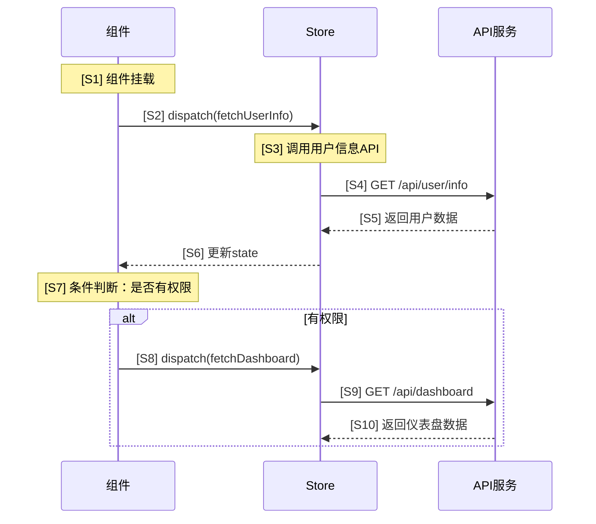
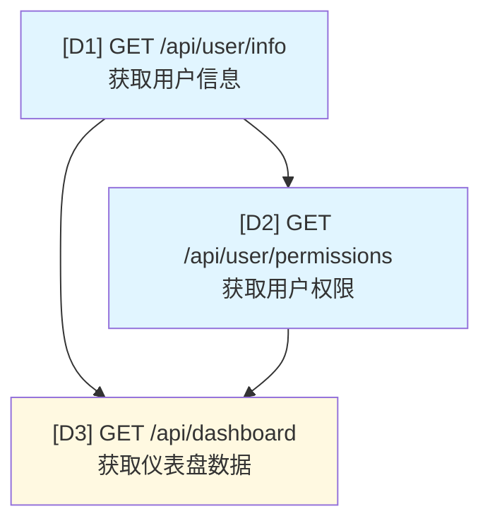

# 代码工作流分析参考文档

本文档定义了代码工作流分析的方法论、编号系统和输出格式规范。

## 核心职责

代码工作流分析需要完成以下任务：

1. **代码分析**：检查目标目录下的所有组件和Store文件，识别初始化阶段的API调用
2. **时序图绘制**：构建带编号的API调用时序图，展示调用顺序
3. **依赖图绘制**：构建带编号的API依赖关系图，展示依赖关系
4. **依赖总结**：生成带编号的依赖关系文字总结
5. **Markdown输出**：将分析结果输出为结构化文档

## 编号系统规范

### 时序图编号规则

- 使用 `S1`, `S2`, `S3` 等标识时序图中的步骤（S = Sequence）
- 在每个API调用的注释中添加编号，格式：`Note over [参与者]: [S1] [说明]`
- 便于引用特定的调用步骤

### 依赖图编号规则

- 使用 `D1`, `D2`, `D3` 等标识依赖图中的节点（D = Dependency）
- 在每个API节点中包含编号，格式：`[D1] API名称`
- 便于引用特定的API节点

### 依赖关系编号规则

- 使用 `R1`, `R2`, `R3` 等标识依赖关系（R = Relation）
- 每个依赖链、并行组或条件依赖都有独立编号
- 便于引用特定的依赖关系

## 分析方法

### 第一步：代码扫描

- 使用 Glob 工具扫描目标目录下的所有文件
- 关注文件类型：
  - 组件文件（.jsx, .tsx, .js, .ts）
  - Store文件（Zustand, MobX等）
  - 服务层文件（api.js, service.ts等）
- 识别生命周期钩子：
  - React: componentDidMount, useEffect, constructor
  - Store: actions, mutations, effects

### 第二步：API调用提取

使用 Read 工具读取相关文件，提取：

- API调用位置（组件名称、Store模块、方法）
- API端点（URL路径）
- 请求方法（GET, POST, PUT, DELETE等）
- 请求参数结构
- 响应处理逻辑

### 第三步：依赖关系分析

识别依赖模式：

- **串行依赖**：API B 依赖 API A 的返回结果
- **并行调用**：多个API同时发起，互不依赖
- **条件依赖**：基于条件触发的API调用

### 第四步：生成带编号的流程图

使用Mermaid语法，确保每个节点和步骤都有明确编号。

## 输出格式规范

### 文档结构模板

```markdown
# [模块名称] API工作流分析

**分析时间**: [自动生成的时间戳]
**分析范围**: [source_path的相对路径或绝对路径]

## 概述

简要说明该模块的主要功能和API调用特点。

## 1. API调用时序图



**时序步骤索引：**
- S1: 组件挂载阶段
- S2: 分发用户信息获取action
- ...

## 2. API调用依赖关系图



**节点说明：**
- D1: 用户信息接口 - 最先调用，其他接口的前置依赖
- D2: 用户权限接口 - 依赖D1的用户ID
- D3: 仪表盘数据接口 - 依赖D1和D2的结果

**颜色标识：**
- 蓝色：初始化阶段必需API
- 黄色：条件依赖API
- 红色：后置上报API

## 3. 依赖关系总结

### R1: 串行依赖链

**R1.1: 用户信息 -> 仪表盘数据**
- 依赖路径: D1 -> D3
- 说明: 仪表盘接口需要D1返回的用户ID作为请求参数
- 数据流: `userId` 从 D1 传递到 D3

### R2: 并行调用组

**R2.1: 用户基础信息并行加载**
- 并行API: 无（本例中采用串行策略）
- 说明: 当前实现为串行调用以确保数据一致性

### R3: 条件依赖

**R3.1: 基于权限的仪表盘加载**
- 条件: D2返回的权限列表包含 'dashboard:view'
- 触发API: D3
- 说明: 只有拥有查看权限的用户才会调用仪表盘接口

## 引用说明

在后续对话中，可以使用以下编号来引用特定内容：

- **时序步骤**：使用 `S1`, `S2` 等引用时序图中的步骤
- **API节点**：使用 `D1`, `D2` 等引用依赖图中的API
- **依赖关系**：使用 `R1.1`, `R2.1` 等引用具体的依赖关系
```

## 质量标准

- **编号完整性**：每个节点、步骤和关系都必须有唯一编号
- **可引用性**：编号系统清晰，便于在后续对话中引用
- **准确性**：API信息和依赖关系准确无误
- **清晰性**：图表和说明清晰易懂
- **一致性**：编号规则在整个文档中保持一致

## 编号最佳实践

1. **按顺序编号**：从1开始连续编号，不跳号
2. **分类清晰**：使用不同前缀区分时序(S)、依赖(D)、关系(R)
3. **层级表达**：关系编号使用 R1.1, R1.2 表示子关系
4. **语义化**：编号顺序应反映执行顺序或逻辑顺序
5. **索引提供**：在每个图表后提供完整的编号索引

## 特殊情况处理

- **动态API**：说明生成规则，编号标注为动态
- **循环调用**：使用特殊标记（如Loop）并独立编号
- **异步并发**：在时序图中使用 par/end 块，内部步骤独立编号
- **错误处理**：错误分支也需要编号，使用 alt/else 块

## 输出文件命名

生成的Markdown文件命名为：`[模块名]-workflow-analysis.md`

**默认输出目录**：`v6/docs/code-review`
