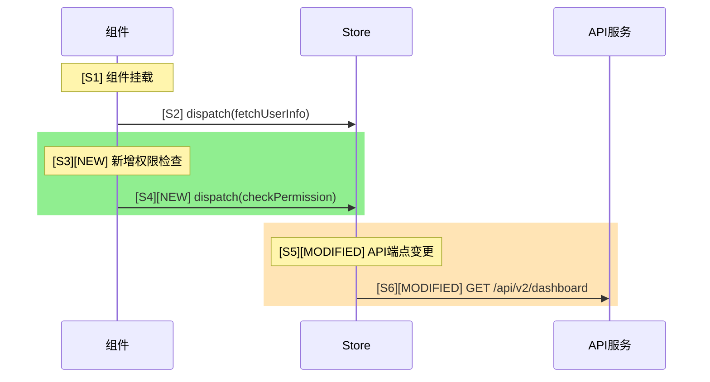
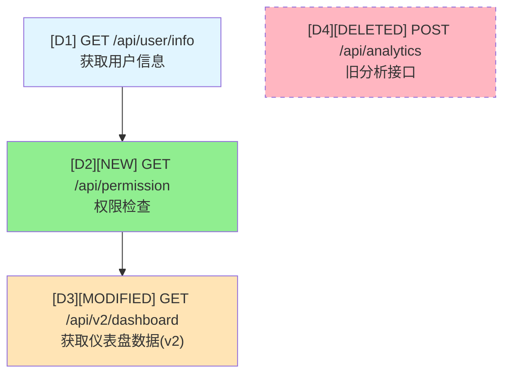

# 变更工作流报告格式参考文档

本文档定义了代码变更审查报告的输出格式规范和变更标注方法。

## 变更标注规范

### Mermaid 图表标注

在 Mermaid 图表中使用以下标注区分变更类型：

| 变更类型 | 颜色 | 样式代码 | 编号后缀 |
|---------|------|----------|---------|
| 新增 | 绿色 | `style Dx fill:#90EE90` | `[NEW]` |
| 修改 | 黄色 | `style Dx fill:#FFE4B5` | `[MODIFIED]` |
| 删除 | 红色虚线 | `style Dx fill:#FFB6C1,stroke-dasharray: 5 5` | `[DELETED]` |
| 未变更 | 蓝色 | `style Dx fill:#e1f5ff` | 无后缀 |

### 时序图变更标注

使用 `rect` 块包裹变更区域：



### 依赖图变更标注



## 报告结构模板

```markdown
# [模块名称] 代码变更审查报告

**审查时间**: [时间戳]
**分析范围**: [source_path]
**变更来源**: [git:xxx 模式]

## 一、变更概述

### 变更统计
| 类型 | 文件数 | 变更行数 |
|------|--------|---------|
| 新增 (A) | X | +XX |
| 修改 (M) | X | +XX/-XX |
| 删除 (D) | X | -XX |

### 变更文件清单
- [A] src/components/NewComponent.tsx
- [M] src/hooks/useAuth.ts
- [D] src/utils/oldHelper.ts

## 二、工作流对比

### 2.1 变更前时序图
[基准时序图，来自阶段一]

### 2.2 变更后时序图
[标注变更的时序图，使用 rect 块和颜色标注]

### 2.3 变更前依赖图
[基准依赖图，来自阶段一]

### 2.4 变更后依赖图
[标注变更的依赖图，使用 style 和颜色标注]

## 三、变更影响分析

### 3.1 新增内容分析

**[编号] 变更标题**
- **变更位置**: 文件路径
- **变更描述**: 描述新增的功能或逻辑
- **影响评估**: 
  - 影响等级: 高/中/低
  - 影响范围: 受影响的文件或组件
  - 需要验证: 验证要点

### 3.2 修改内容分析

**[编号] 变更标题**
- **变更位置**: 文件路径:行号范围
- **原始内容**: 修改前的 API/函数/逻辑
- **新内容**: 修改后的 API/函数/逻辑
- **变更原因**: 为什么需要修改
- **影响评估**:
  - 影响等级: 高/中/低
  - 影响范围: X个文件，Y处调用
  - 破坏性变更: 是/否
  - 需要验证: 验证要点

### 3.3 删除内容分析

**[编号] 删除标题**
- **删除位置**: 文件路径
- **删除内容**: 删除的 API/函数/组件
- **影响评估**:
  - 影响等级: 高/中/低
  - 影响范围: 需确认无残留调用
  - 风险: 潜在风险说明

## 四、依赖关系变更

### R1: 新增依赖链

**R1.1: 依赖链名称**
- 依赖路径: D1 -> D2 -> D3
- 变更说明: 描述新增的依赖关系
- 影响: 对系统的影响

### R2: 修改的依赖

**R2.1: 依赖链名称**
- 原路径: 原始依赖路径
- 新路径: 修改后的依赖路径
- 变更说明: 描述修改内容

### R3: 删除的依赖

**R3.1: 依赖链名称**
- 原路径: 被删除的依赖路径
- 变更说明: 描述删除原因
- 需确认: 是否有替代方案

## 五、风险评估

### 高风险项
1. **风险名称**: 风险描述和影响
2. **风险名称**: 风险描述和影响

### 中风险项
1. **风险名称**: 风险描述和影响

### 低风险项
1. **风险名称**: 风险描述和影响

## 六、验证建议

### 必须验证
- [ ] 验证项目 1
- [ ] 验证项目 2

### 建议验证
- [ ] 验证项目 1
- [ ] 验证项目 2

## 七、总结

### 变更要点
1. 要点 1（关联编号）
2. 要点 2（关联编号）

### 审查结论
- **整体风险等级**: 高/中/低
- **建议**: 审查建议
- **回滚方案**: 回滚策略

---

**引用说明**：
- 时序步骤：S1, S2, S3...
- API节点：D1, D2, D3...
- 依赖关系：R1.1, R2.1, R3.1...
- 变更标记：[NEW], [MODIFIED], [DELETED]
```

## 影响等级评估标准

| 影响等级 | 说明 | 示例 |
|---------|------|------|
| 高 | 函数签名变化、破坏性变更、核心业务逻辑修改、公共API变更 | 参数增删改、删除导出、返回值类型变化 |
| 中 | 内部实现变化但接口一致、新增可选参数、行为轻微变化 | 逻辑优化、添加可选参数 |
| 低 | 纯内部重构、性能优化、代码风格调整 | 变量重命名、格式调整 |

## 验证命令参考

```bash
# TypeScript 编译检查
tsc --noEmit

# 搜索旧端点引用
grep -r "旧API路径" src --include="*.ts" --include="*.tsx"

# 运行相关测试
npm test -- --testPathPattern="相关模块"

# 完整构建验证
npm run build
```

## 文件命名规范

生成的报告文件命名为：`[模块名]-change-review-[时间戳].md`

时间戳格式：`YYYY-MM-DD_HH-MM-SS`

**默认输出目录**：`v6/docs/code-review`
